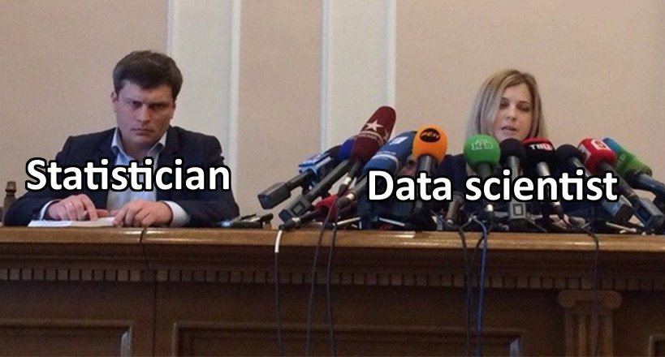
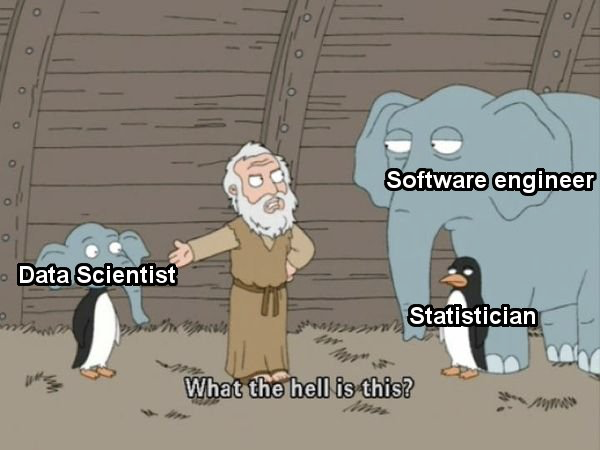
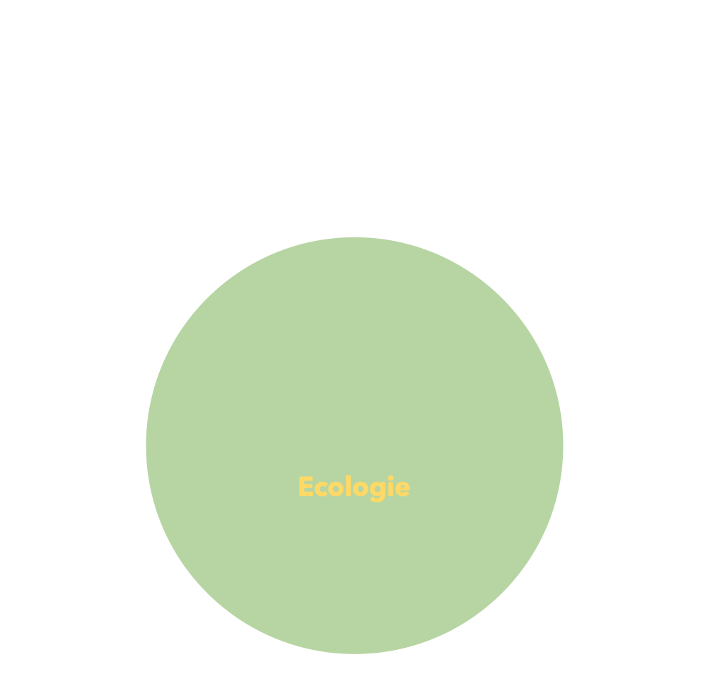
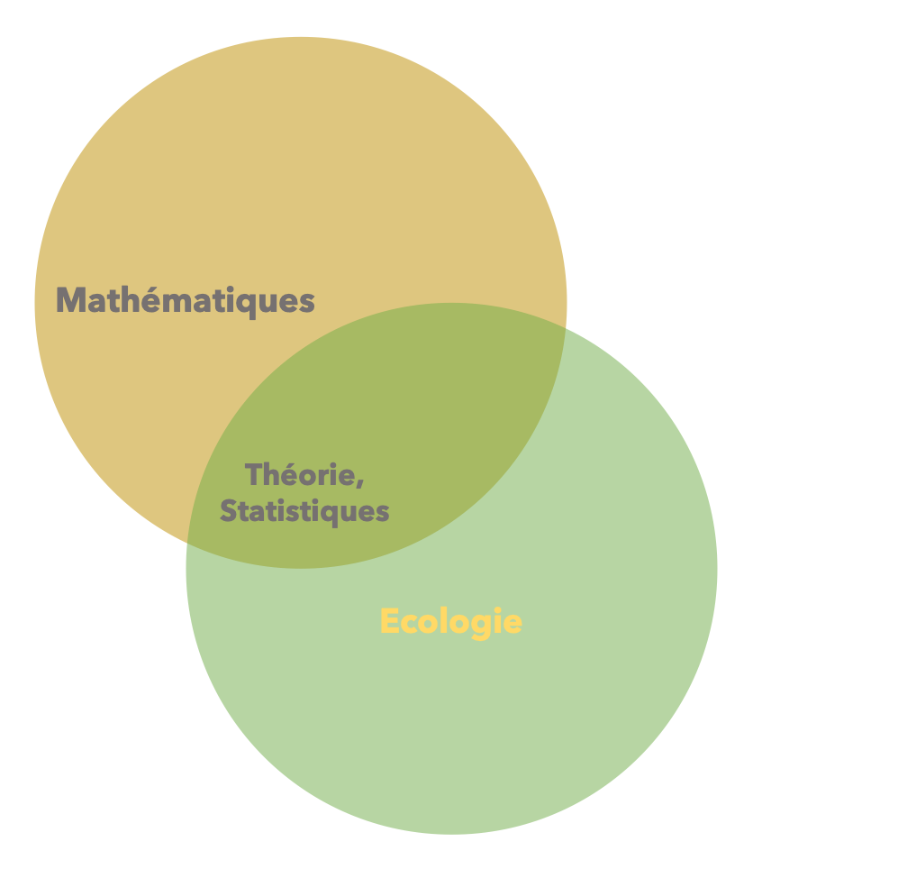
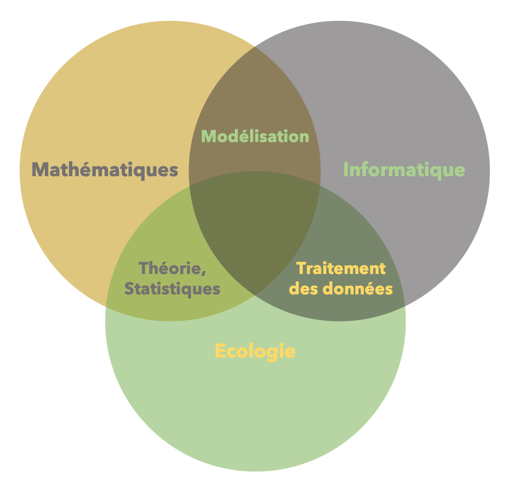
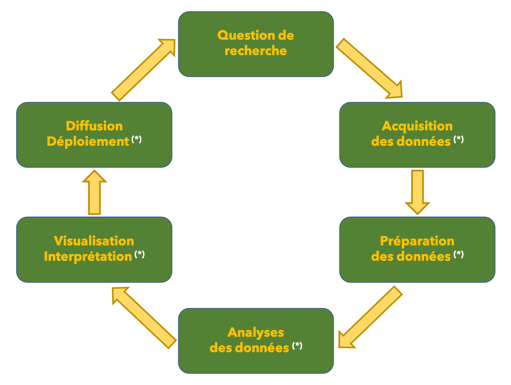
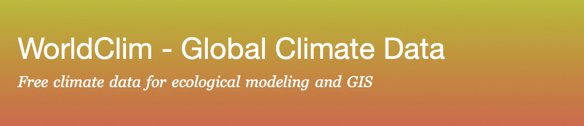
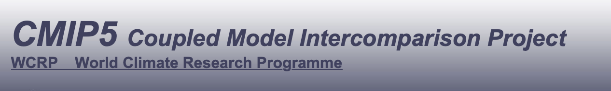

```{r echo=FALSE, eval=TRUE}
  spplist <- read.csv("data/taxonomy.csv", header = TRUE, sep = ";")
  spp     <- yaml::yaml.load_file("data/species.yml")
  spplist <- spplist[spplist[ , "key"] == spp$species, ]
```


layout: true
class: center, top
background-image: url("img/background_home.png")

---

.home-content[

  .event[
    Le CESAB à la FRB
  ]
  .main-talk[
    C'est quoi un data scientist ?
  ]
  .sub-talk[

  ]
  .speaker[
    Nicolas Casajus
  ]
  .function[
    Chargé de mission Eco-informaticien / Data scientist
  ]
  .date[
    Paris &#8212; Lundi 06 mai 2019
  ]
]

---

name: slide
layout: true
class: left, top, slide
background-image: url("img/background_slides.png")

---

### Data scientist, la nouvelle star !

.slide-content[

  <br /><br />

  ```{r echo=FALSE, out.width="65%", fig.align="center"}
  
  ```

]

---

name: slide
layout: true
class: left, top, slide
background-image: url("img/background_slides.png")

---

### Data scientist, _what the hell is that?_

.slide-content[

  <br /><br />

  ```{r echo=FALSE, out.width="65%", fig.align="center"}
  
  ```

]

---

name: slide
layout: true
class: left, top, slide
background-image: url("img/background_slides.png")

---

### Data science en écologie

.slide-content[

  ```{r echo=FALSE, out.width="65%", fig.align="center"}
  
  ```

]


---

name: slide
layout: true
class: left, top, slide
background-image: url("img/background_slides.png")

---

### Data science en écologie

.slide-content[

  ```{r echo=FALSE, out.width="65%", fig.align="center"}
  
  ```

]

]

---

name: slide
layout: true
class: left, top, slide
background-image: url("img/background_slides.png")

---

### Data science en écologie

.slide-content[

  ```{r echo=FALSE, out.width="65%", fig.align="center"}
  
  ```

]

---

name: slide
layout: true
class: left, top, slide
background-image: url("img/background_slides.png")

---

### Data science en écologie

.slide-content[

  ```{r echo=FALSE, out.width="65%", fig.align="center"}
  knitr::include_graphics("img/venn-7.png")
  ```

]


---

name: slide
layout: true
class: left, top, slide
background-image: url("img/background_slides.png")

---

### La recherche scientifique

.slide-content[
  ```{r echo=FALSE, out.width="90%", fig.align="center"}
  
  ```
]


---

name: slide
layout: true
class: left, top, slide
background-image: url("img/background_slides.png")

---

### Illustration avec un cas d'étude

.slide-content[

  #### Question scientifique

  Quels seront les impacts potentiels futurs du changement climatique sur la répartition géographique du **`r spplist[1, "french"]`** (_`r spplist[1, "latin"]`_) ?

  <br />

  .pull-left[
    ```{r echo=FALSE, out.width="100%", out.height="205px", fig.align="center"}
    
    ```
  ]

  .pull-right[
    ```{r echo=FALSE, out.width="100%", out.height="205px", fig.align="center"}
    knitr::include_graphics(paste0("img/", spplist[1, "file"],".jpg"))
    ```
  ]
]


---

name: slide
layout: true
class: left, top, slide
background-image: url("img/background_slides.png")

---

### Illustration avec un cas d'étude

.slide-content[

  #### Acquisition des données


  .pull-left[
- Répartition de l'espèce

    ```{r echo=FALSE, out.width="100%", out.height="65px", fig.align="left"}
    
    ```
  .url[
    [https://www.iucnredlist.org](https://www.iucnredlist.org)
  ]
  ]

  .pull-right[
- Climat actuel

    ```{r echo=FALSE, out.width="100%", out.height="65px", fig.align="left"}
    
    ```
  .url[
    [https://www.worldclim.org](https://www.worldclim.org)
  ]

    <br />

- Climat futur

    ```{r echo=FALSE, out.width="100%", out.height="65px", fig.align="left"}
    
    ```
  .url[
    [https://cmip.llnl.gov/cmip5/](https://cmip.llnl.gov/cmip5/)
  ]

  .parag[
Modèle climatique CNRM-CM5 (RCP85)
Horizon 2070
  ]
  ]
]


---

name: slide
layout: true
class: left, top, slide
background-image: url("img/background_slides.png")

---

### Illustration avec un cas d'étude

.slide-content[

  #### Préparation des données \[...\]

.pull-left[

.center[
  `r spplist[1, "french"]`
]

  ```{r echo=FALSE, out.width="90%", fig.align="center"}
  knitr::include_graphics(paste0("img/map-", spplist[1, "file"],"-obs.png"))
  ```
]

.pull-right[

.center[
  Température actuelle
]

  ```{r echo=FALSE, out.width="90%", fig.align="center"}
  knitr::include_graphics(paste0("img/map-temp-obs.png"))
  ```
]

]


---

name: slide
layout: true
class: left, top, slide
background-image: url("img/background_slides.png")

---

### Illustration avec un cas d'étude

.slide-content[

  #### Analyses des données

- Modèle de niche

.parag[
  Trouver la relation entre la répartition du `r spplist[1, "french"]` et le climat

  (ex. groupes .em[FREE] et .em[GASPAR])
]

]


---

name: slide
layout: true
class: left, top, slide
background-image: url("img/background_slides.png")

---

### Illustration avec un cas d'étude

.slide-content[

  #### Analyses des données

- Modèle de niche

.parag[
  Trouver la relation entre la répartition du `r spplist[1, "french"]` et le climat

  (ex. groupes .em[FREE] et .em[GASPAR])
]

<br />


- Projection dans le futur

.parag[
  Projeter cette relation dans le futur sous un scénario de changement climatique
]
]


---

name: slide
layout: true
class: left, top, slide
background-image: url("img/background_slides.png")

---

### Illustration avec un cas d'étude

.slide-content[

  #### Visualisation & Interprétation (1)

.pull-left[

.center[
  Observations
]

  ```{r echo=FALSE, out.width="90%", fig.align="center"}
  knitr::include_graphics(paste0("img/map-", spplist[1, "file"],"-obs.png"))
  ```
]

.pull-right[

.center[
  Modèle
]

  ```{r echo=FALSE, out.width="90%", fig.align="center"}
  knitr::include_graphics(paste0("img/map-", spplist[1, "file"], "-cur.png"))
  ```
]
]


---

name: slide
layout: true
class: left, top, slide
background-image: url("img/background_slides.png")

---

### Illustration avec un cas d'étude

.slide-content[

  #### Visualisation & Interprétation (2)

.pull-left[

.center[
  Actuel
]

  ```{r echo=FALSE, out.width="90%", fig.align="center"}
  knitr::include_graphics(paste0("img/map-", spplist[1, "file"],"-cur.png"))
  ```
]

.pull-right[

.center[
  2070
]

  ```{r echo=FALSE, out.width="90%", fig.align="center"}
  knitr::include_graphics(paste0("img/map-", spplist[1, "file"], "-cur.png"))
  ```
]
]

---

name: slide
layout: true
class: left, top, slide
background-image: url("img/background_slides.png")

---

### Illustration avec un cas d'étude

.slide-content[

  #### Diffusion et déploiement

  - Diffusion

  > Cette présentation

]

---

name: slide
layout: true
class: left, top, slide
background-image: url("img/background_slides.png")

---

### Illustration avec un cas d'étude

.slide-content[

  #### Diffusion et déploiement

  - Diffusion

  > Cette présentation

  <br />

  - Déploiement

  > Code (analyse + présentation) disponible :
  >
  > .url[[https://github.com/ahasverus/talk-frb-20190506](https://github.com/ahasverus/talk-frb-20190506)]

  <br />

  > Présentation en ligne :
  >
  > .url[[https://ahasverus.github.io/talk-frb-20190506](https://ahasverus.github.io/talk-frb-20190506)]

]

---

name: slide
layout: true
class: left, top, slide
background-image: url("img/background_slides.png")

---

### Illustration avec un cas d'étude

.slide-content[

  #### Diffusion et déploiement

  - Diffusion

  > Cette présentation

  <br />

  - Déploiement

  > Code (analyse + présentation) disponible :
  >
  > .url[[https://github.com/ahasverus/talk-frb-20190506](https://github.com/ahasverus/talk-frb-20190506)]

  <br />

  > Présentation en ligne :
  >
  > .url[[https://ahasverus.github.io/talk-frb-20190506](https://ahasverus.github.io/talk-frb-20190506)]

  <br />

  - Reproductibilité + Versioning + Automatisation

]
