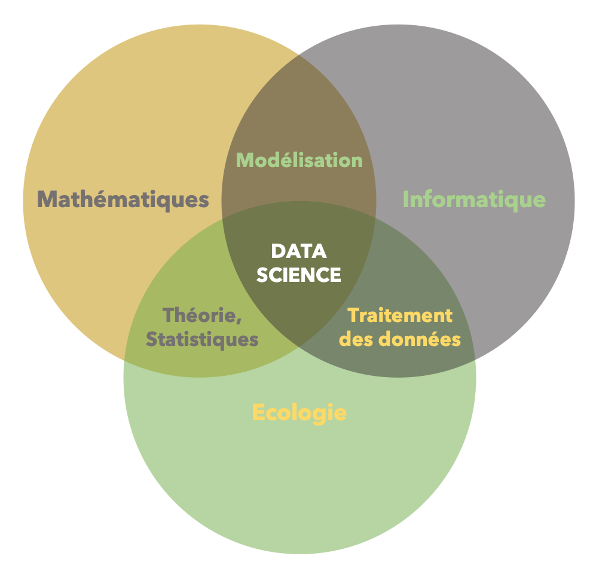
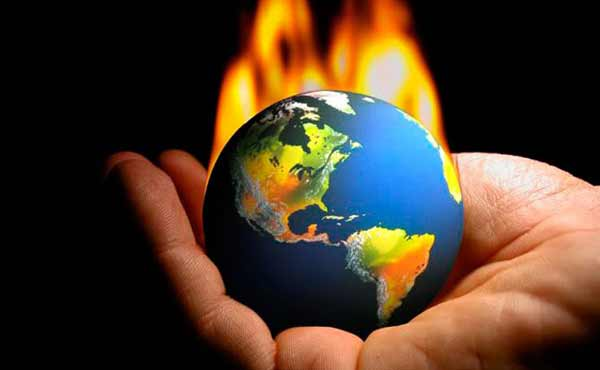

```{r echo=FALSE, eval=TRUE}
  spplist <- read.csv("data/taxonomy.csv", header = TRUE, sep = ";")
  spp     <- yaml::yaml.load_file("data/species.yml")
  spplist <- spplist[spplist[ , "key"] == spp$species, ]
```


layout: true
class: center, top
background-image: url("img/background_home.png")

---

.home-content[

  .event[
    Le CESAB à la FRB
  ]
  .main-talk[
    C'est quoi un data scientist ?
  ]
  .sub-talk[

  ]
  .speaker[
    Nicolas Casajus
  ]
  .function[
    Chargé de mission Eco-informaticien / Data scientist
  ]
  .date[
    Paris &#8212; Lundi 06 mai 2019
  ]
]

---

name: slide
layout: true
class: left, top, slide
background-image: url("img/background_slides.png")

---

### Data scientist, la nouvelle star !

.slide-content[

  <br /><br />

  ```{r echo=FALSE, out.width="65%", fig.align="center"}
  knitr::include_graphics("img/interview.jpg")
  ```

]

---

name: slide
layout: true
class: left, top, slide
background-image: url("img/background_slides.png")

---

### Data scientist, _what the hell is that?_

.slide-content[

  <br /><br />

  ```{r echo=FALSE, out.width="65%", fig.align="center"}
  
  ```

]

---

name: slide
layout: true
class: left, top, slide
background-image: url("img/background_slides.png")

---

### Data science en écologie

.slide-content[

  ```{r echo=FALSE, out.width="65%", fig.align="center"}
  knitr::include_graphics("img/venn-1.png")
  ```

]

---

name: slide
layout: true
class: left, top, slide
background-image: url("img/background_slides.png")

---

### Data science en écologie

.slide-content[

  ```{r echo=FALSE, out.width="65%", fig.align="center"}
  knitr::include_graphics("img/venn-2.png")
  ```

]

---

name: slide
layout: true
class: left, top, slide
background-image: url("img/background_slides.png")

---

### Data science en écologie

.slide-content[

  ```{r echo=FALSE, out.width="65%", fig.align="center"}
  
  ```

]

---

name: slide
layout: true
class: left, top, slide
background-image: url("img/background_slides.png")

---

### Data science en écologie

.slide-content[

  ```{r echo=FALSE, out.width="65%", fig.align="center"}
  
  ```

]

---

name: slide
layout: true
class: left, top, slide
background-image: url("img/background_slides.png")

---

### Data science en écologie

.slide-content[

  ```{r echo=FALSE, out.width="65%", fig.align="center"}
  knitr::include_graphics("img/venn-5.png")
  ```

]

---

name: slide
layout: true
class: left, top, slide
background-image: url("img/background_slides.png")

---

### Data science en écologie

.slide-content[

  ```{r echo=FALSE, out.width="65%", fig.align="center"}
  knitr::include_graphics("img/venn-6.png")
  ```

]

---

name: slide
layout: true
class: left, top, slide
background-image: url("img/background_slides.png")

---

### Data science en écologie

.slide-content[

  ```{r echo=FALSE, out.width="65%", fig.align="center"}
  
  ```

]


---

name: slide
layout: true
class: left, top, slide
background-image: url("img/background_slides.png")

---

### La recherche scientifique

.slide-content[
  ```{r echo=FALSE, out.width="90%", fig.align="center"}
  
  ```
]


---

name: slide
layout: true
class: left, top, slide
background-image: url("img/background_slides.png")

---

### La recherche scientifique

.slide-content[
  ```{r echo=FALSE, out.width="90%", fig.align="center"}
  
  ```
]


---

name: slide
layout: true
class: left, top, slide
background-image: url("img/background_slides.png")

---

### La recherche scientifique

.slide-content[
  ```{r echo=FALSE, out.width="90%", fig.align="center"}
  
  ```
]


---

name: slide
layout: true
class: left, top, slide
background-image: url("img/background_slides.png")

---

### La recherche scientifique

.slide-content[
  ```{r echo=FALSE, out.width="90%", fig.align="center"}
  
  ```
]


---

name: slide
layout: true
class: left, top, slide
background-image: url("img/background_slides.png")

---

### La recherche scientifique

.slide-content[
  ```{r echo=FALSE, out.width="90%", fig.align="center"}
  
  ```
]


---

name: slide
layout: true
class: left, top, slide
background-image: url("img/background_slides.png")

---

### La recherche scientifique

.slide-content[
  ```{r echo=FALSE, out.width="90%", fig.align="center"}
  
  ```
]


---

name: slide
layout: true
class: left, top, slide
background-image: url("img/background_slides.png")

---

### La recherche scientifique

.slide-content[
  ```{r echo=FALSE, out.width="90%", fig.align="center"}
  knitr::include_graphics("img/research-7.png")
  ```
]


---

name: slide
layout: true
class: left, top, slide
background-image: url("img/background_slides.png")

---

### Illustration avec un cas d'étude

.slide-content[

  #### Question scientifique

  Quels seront les impacts potentiels futurs du changement climatique sur la répartition géographique du **`r spplist[1, "french"]`** (_`r spplist[1, "latin"]`_) ?

  <br />

  .pull-left[
    ```{r echo=FALSE, out.width="100%", out.height="205px", fig.align="center"}
    
    ```
  ]

  .pull-right[
    ```{r echo=FALSE, out.width="100%", out.height="205px", fig.align="center"}
    knitr::include_graphics(paste0("img/", spplist[1, "file"],".jpg"))
    ```
  ]
]


---

name: slide
layout: true
class: left, top, slide
background-image: url("img/background_slides.png")

---

### La recherche scientifique

.slide-content[
  ```{r echo=FALSE, out.width="90%", fig.align="center"}
  knitr::include_graphics("img/research-7.png")
  ```
]


---

name: slide
layout: true
class: left, top, slide
background-image: url("img/background_slides.png")

---

### Reproductibilité & automatisation

.slide-content[
  ```{r echo=FALSE, out.width="90%", fig.align="center"}
  
  ```
]


---

name: slide
layout: true
class: left, top, slide
background-image: url("img/background_slides.png")

---

### Notions fondamentales

.slide-content[

]
